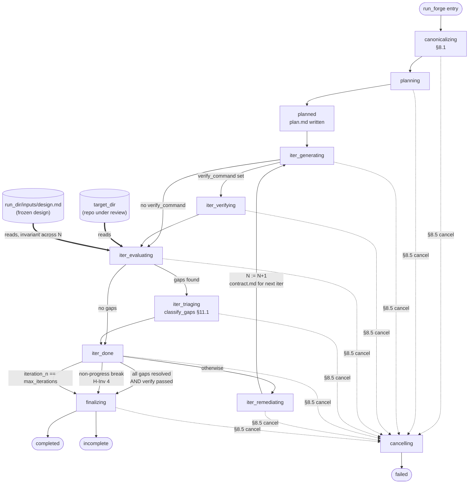

# FORGE MCP

forge-mcp is a stdio MCP server that orchestrates an autonomous Planner → Generator → Evaluator loop for implementing features from design documents. It exposes a single `run_forge` tool that blocks until completion and streams progress updates, persisting all artifacts under `<target_dir>/.harness/<run-id>/`.

## Installation Steps

**1. Clone and install dependencies:**

```sh
git clone https://github.com/chindada/forge-mcp.git
cd forge-mcp
uv sync
```

**2. Install the codex binary:**

```sh
npm install -g @openai/codex
```

**3. Verify environment:**

```sh
uv run forge doctor
```

The doctor command runs seven checks: `target_dir` writable, `.harness` writable, disk-space (warn-only), `claude` CLI, `codex` binary + import + live model probe, Claude auth, and the required `superpowers:writing-plans` skill. Exit code 0 means success; any `[FAIL]` must be addressed before proceeding.

The `forge` CLI exposes three commands: `forge doctor` (above), `forge serve` (the stdio server, registered in step 4), and `forge version` (print the installed version).

**4. Register with Claude Code:**

```sh
claude mcp add forge-mcp -- uv run --directory $PWD forge serve
```

Place the server name before any `-e` environment flags to avoid parsing errors.

```sh
claude mcp add --scope user forge-mcp \
  -e CLAUDE_CONFIG_DIR=$HOME/.claude \
  -e FORGE_CODEX_BIN=$(which codex) \
  -- uv run --directory $PWD forge serve
```

**5. Run the example:**

```sh
# In Claude Code, ask forge-mcp to process examples/tiny-feature.md
# Expected runtime: ~5-10 minutes, resulting in a working /healthz route.
```

**6. Optional — project instructions for the Generator:**
Codex (the Generator) auto-discovers `AGENTS.md` (or `AGENTS.override.md`) from your `target_dir` upward and threads it into its system prompt. If neither file exists, forge-mcp emits a warning at run start. If your repo already has a `CLAUDE.md`, symlink it so both toolchains share one source of truth:

```sh
ln -s CLAUDE.md AGENTS.md
```

**7. Inspect results:**

```sh
ls <target_dir>/.harness/<run-id>/
cat <target_dir>/.harness/<run-id>/iteration-1/eval.md
```

## Calling run_forge

`run_forge` is the server's single tool. It blocks until the run reaches a terminal state and streams progress updates while it works.

### From a Claude Code session

Once registered (step 4), invoke it in natural language — the host fills the tool's input schema from your request:

> _"Use forge-mcp to implement the design in `docs/feature.md` into `/path/to/repo`, and verify it with `npm test`."_

Point it at a design document on disk (`design_doc_path`) or paste the text inline (`design_doc_content`) — exactly one is required. A run can occupy the session for up to `max_runtime_minutes`; for long runs prefer task-mode (below) so it survives a client disconnect.

### Input parameters

| Parameter                | Type   | Default      | Notes                                                                                                                            |
| ------------------------ | ------ | ------------ | -------------------------------------------------------------------------------------------------------------------------------- |
| `target_dir`             | string | _(required)_ | Directory the Generator reads and writes                                                                                         |
| `design_doc_path`        | string | _(none)_     | Path to the design document — mutually exclusive with `design_doc_content`                                                       |
| `design_doc_content`     | string | _(none)_     | Inline design document text — mutually exclusive with `design_doc_path`                                                          |
| `max_iterations`         | int    | `10`         | Planner → Generator → Evaluator loops; `1`–`100`                                                                                 |
| `max_runtime_minutes`    | int    | `600`        | Hard wall-clock cap for the whole run; `1`–`1440`                                                                                |
| `verify_command`         | string | _(none)_     | Shell command run to confirm the feature works                                                                                   |
| `verify_timeout_seconds` | int    | `1800`       | Timeout for `verify_command`; `1`–`86400`                                                                                        |
| `resume`                 | bool   | `false`      | Resume the last incomplete run in `target_dir`                                                                                   |
| `ignore_prior_attempts`  | bool   | `false`      | Opt out of cross-run learning for this call                                                                                      |

Exactly one of `design_doc_path` / `design_doc_content` must be supplied; providing both or neither is rejected.

### What you get back

`run_forge` returns a `RunResult` whose `status` is one of:

- **`completed`** — every design gap the Evaluator found was resolved.
- **`incomplete`** — a cap (iterations or runtime) was hit first, and `unresolved_gaps` is populated. This is honest non-convergence, not a failure.
- **`failed`** — a fatal error stopped the run; `failed_phase`, `error_class`, and `failure_kind` explain where and why.

Other fields include `run_id`, `run_dir` (the `<target_dir>/.harness/<run-id>/` path), `iterations_used`, `runtime_seconds`, `unresolved_gaps`, `artifacts` (paths to `plan.md`, per-iteration `eval.md`, …), and a human-readable `message`.

### Run lifecycle

A run is a state machine over the `StateLiteral` values written to
`state.json`. Solid edges are normal transitions; the thick `==>` edges show
the evaluator's two read roots — the user's `target_dir` (the repo under
review) and `run_dir/inputs/design.md` (the frozen design spec, written once
during `canonicalizing`). Those two roots are invariant across iterations
and read in a fresh session (no prior gaps, plan, or contract are fed in);
the prompt may carry a per-iteration `changed_files` review-ordering hint
(§H8), but the underlying artifacts do not change.

`finalizing` is reached only on natural cap-hit or normal-completion paths
and exits to `completed` or `incomplete`. Two terminals bypass `finalizing`
entirely: dashed edges are the §8.5 cancellation path (any live phase →
`cancelling` → `failed`, with the run lock released between them); a fatal
exception in any live phase short-circuits directly to `failed` via
`handle_failure` in `lifecycle.py` (not drawn — would duplicate the cancel
fan-out).



### Task-mode callers (`call_tool_as_task`)

When invoking `run_forge` via `session.experimental.call_tool_as_task(...)`
(MCP task augmentation — see the [long-run continuity brief](docs/specs/forge-mcp-long-run-continuity.md)),
set the `ttl` parameter to at least `max_runtime_minutes * 60 * 1000`
milliseconds. The server does not enforce a floor — TTL semantics are governed
by the caller's clock — so a too-short TTL will cause the server to age the task
out before the run terminates. See
[§C11 risk 7 in the long-run continuity brief](docs/specs/forge-mcp-long-run-continuity.md)
for the rationale.

```python
ttl_ms = max_runtime_minutes * 60 * 1000
await session.experimental.call_tool_as_task(
    "run_forge",
    {"target_dir": "/repo", "design_doc_content": "...", "max_runtime_minutes": 60},
    ttl=ttl_ms,
)
```

## Configuration

forge-mcp reads the following environment variables (plus the standard Claude auth/profile variables the SDK consults):

| Variable                  | Owner      | Default                             | Purpose                                                                                                                                      |
| ------------------------- | ---------- | ----------------------------------- | -------------------------------------------------------------------------------------------------------------------------------------------- |
| `FORGE_CODEX_BIN`         | forge-mcp  | `codex`                             | Override the codex binary path                                                                                                               |
| `FORGE_CLAUDE_CLI_PATH`   | forge-mcp  | _(none)_                            | Explicit path to the `claude` CLI; threaded into the SDK at runtime, not just preflight                                                      |
| `FORGE_LINEAGE_TOP_K`     | forge-mcp  | `4`                                 | Cross-run learning top-K; validated `[0, 10]`, `0` disables                                                                                  |
| `FORGE_HARNESS_ROOTS`     | forge-mcp  | _(none)_                            | Comma-separated absolute paths whose completed runs appear in `list_resources` across restarts (each must exist and be a readable directory) |
| `FORGE_KEEP_RUNS`         | forge-mcp  | `10`                                | Completed-run retention — newest N kept, older pruned at run start (never the live/resumed run)                                              |
| `CLAUDE_CONFIG_DIR`       | Claude SDK | inherit SDK default (≈ `~/.claude`) | Selects the active Claude profile                                                                                                            |
| `ANTHROPIC_API_KEY`       | Anthropic  | _(none)_                            | Direct API key (highest auth priority)                                                                                                       |
| `CLAUDE_CODE_OAUTH_TOKEN` | Claude SDK | _(none)_                            | Pre-generated OAuth token                                                                                                                    |

Pass variables via `claude mcp add -e KEY=value` or set them in the parent shell.

## Reading run artifacts over MCP

`forge-mcp` exposes a standard MCP resources surface so a host can read on-disk
artifacts (`plan.md`, `eval.md`, `state.json`, `sessions.json`, `status.log`, …)
over the MCP transport instead of filesystem-poking. Two RPC methods are
advertised on the same stdio server that owns `run_forge`:

- `list_resources` — enumerate active and optionally past-run artifacts, with
  cursor pagination via `nextCursor` and a page size of 50.
- `read_resource(uri: AnyUrl)` — read one artifact by its `forge://` URI.

URI shape: `forge://<harness_token>/<run_id>/<artifact_subpath>`, where
`harness_token` is a 12-character `base64url(sha256(abs_harness_dir))[:12]` and
`run_id` is the existing 8-character hex id.

Set `FORGE_HARNESS_ROOTS=/abs/path1,/abs/path2` to make completed runs under
known harness dirs appear in `list_resources` across server restarts. Past runs
remain readable by stable URI; this setting only affects discovery.

`run.log` and `run.lock` are never served. Path traversal, symlink escape, and
non-allowlisted subpaths all yield `McpError(-32002)`.

### Resource subscriptions

forge-mcp advertises MCP resource `subscribe: true` and `listChanged: true`.
Hosts may subscribe to allowlisted `forge://<token>/<run-id>/<artifact>` URIs and
will receive `notifications/resources/updated` after durable artifact writes.
Subscriptions are in-memory and session-scoped: after reconnecting, hosts should
re-list resources, re-read the artifacts they care about, and re-subscribe.

`inputs/design.md` and `inputs/design.fingerprint` are readable and subscribable
for allowlist parity, but they are written before a host can subscribe and do not
produce later `resources/updated` notifications. Run list changes are announced
with `listChanged` when active runs become discoverable or are pruned.

## Security

The `run.log` file may contain sensitive prompt/output snippets and is written with mode `0600`. It never crosses the tool boundary — `RunResult.artifacts` deliberately omits its path.

## Security model

The Generator executes with **full host access**
(`Sandbox.full_access` — the SDK spelling of codex's
`danger-full-access`): unrestricted filesystem writes, unrestricted
network, and no approval prompts (`ApprovalMode.deny_all`). forge-mcp
provides **no in-process isolation boundary at all**. This is a
deliberate, documented posture, not an oversight: the verify gate
already runs caller-supplied shell commands unsandboxed, the
planner/evaluator already run with `bypassPermissions`, and
generator-authored code already executes unsandboxed whenever the
verify gate runs it — a generator-only sandbox provided asymmetric
friction, not security. forge-mcp also deliberately ships no in-process
command denylist (security theater for an agent that can author and
execute scripts). The only real isolation boundary is the one the
deployer provides: **run forge-mcp exclusively against a disposable or
scratch checkout inside an OS/container sandbox you control** (dev
container, VM, jail). Official Codex guidance sanctions full access
precisely and only for such externally-isolated environments.

See the [generator full-access brief (§F)](docs/specs/forge-mcp-generator-full-access.md)
for the rationale; §H7 of the
[long-run hardening brief](docs/specs/forge-mcp-long-run-hardening.md)
records the threat-model groundwork this brief completes.

**Migration (≥ this version):** the `network_access` input field was
removed (see the [generator full-access brief
(§F3)](docs/specs/forge-mcp-generator-full-access.md)). Callers still
passing it — saved MCP invocations, scripts, recipes — must drop the
field; it now fails validation (`extra_forbidden`). There is no
behavioral replacement: network is always available to the generator,
as it already was by default.

## Cross-run learning

Each `run_forge` invocation auto-detects prior terminal runs on the same
design document (matched by SHA-256 fingerprint over the canonicalized
design text) and feeds the planner a structured digest of what didn't
work. The digest is rendered to `inputs/prior_attempts.md` and read by
the planner through the same `add_dirs=[inputs/]` surface as `design.md`.

**Anti-anchoring is load-bearing.** The planner prompt directs the model
to propose a _different_ implementation strategy when prior gaps recur,
not to refine a multiply-failed approach.

**Controls:**

- `ignore_prior_attempts: bool = False` on `RunForgeInput` — per-call
  opt-out.
- `FORGE_LINEAGE_TOP_K` env var (default 4, validated `[0, 10]`,
  `0` = kill switch) — per-deployment opt-out.

**Threat model.** Lineage is bounded to a single `target_dir` — two
tenants would need to share both `target_dir` AND write byte-identical
design docs for any cross-tenant bleed. Operators with sensitive
workloads should set `FORGE_LINEAGE_TOP_K=0`. See the
[cross-run learning brief (§L16)](docs/specs/forge-mcp-cross-run-learning.md)
for the full risk catalog.

## Development

```sh
make help                      # list all targets
make setup                     # install project + dev extras (uv sync --all-extras)
make fmt                       # apply safe ruff autofixes + format
make lint                      # ruff check + format check + pyright + docstrings
make test                      # fast tests (pytest -m "not slow"); matches CI
make ci                        # full merge gate: lint + test (== scripts/ci.sh)

# Raw uv equivalents (if make is unavailable):
uv sync --all-extras           # install dev dependencies (ruff, pyright, pytest)
uv run ruff check
uv run pyright
uv run pytest -m "not slow"
bash scripts/ci.sh             # full gate: ruff + format check + pyright + docstring check + pytest
```

End-to-end tests marked `@pytest.mark.slow` exercise the real `claude` and `codex` CLIs and are excluded by default.

## Troubleshooting

- **Claude CLI missing**: `npm install -g @anthropic-ai/claude-code`, or set `FORGE_CLAUDE_CLI_PATH` to an explicit path.
- **Codex missing**: `npm install -g @openai/codex`.
- **SDK import fails**: re-run `uv sync`.
- **Auth fails**: set `ANTHROPIC_API_KEY`, set `CLAUDE_CODE_OAUTH_TOKEN`, or run `claude login`.
- **MCP registration error**: place the server name before `-e` flags: `claude mcp add forge-mcp -e KEY=value -- ...`.
- **Lock busy**: another run holds `<target_dir>/.harness/run.lock`. Stale recovery kicks in when the holding PID is dead or the lockfile mtime is older than 36 hours.

## License

MIT — see `LICENSE`.
