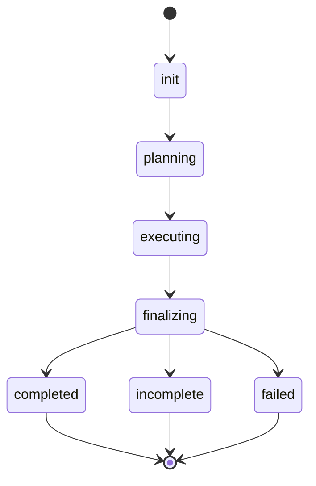

# forge-mcp

`forge-mcp` is a stdio [MCP](https://modelcontextprotocol.io) server that exposes a single tool, **`run_forge`**, which implements a feature from a design document directly into a target directory. It drives a **Planner** (Claude) that produces **one** plan, then a **Generator** (Codex) → **Evaluator** (Claude) iteration loop that edits `target_dir` in place until the plan is done or the run stops honestly. Every artifact of a run is persisted under `<target_dir>/.harness/<run-id>/`. This is version `0.1.0`.

## How it works

A single run does three things, in order:

1. **Plan once.** The Planner (Claude) reads the design document and produces exactly **one** plan.
2. **Iterate one loop.** A single iteration loop runs directly on `target_dir`: **generate** (Codex edits the directory) → optional **verify** → **evaluate** (Claude) → optional **triage** → **converge**. Design-fault amendments are applied **in-loop**. The loop stops when the plan reaches `done`, or — when it stops making progress — honestly reports `incomplete` rather than spinning.
3. **Finalize.** The run returns a `RunResult` describing the outcome.

Each phase runs in a **fresh SDK session** — no conversation or model state is carried across phases. Phases hand off **only** through the on-disk artifacts under `.harness/<run-id>/`. The Generator edits the repository in place and leaves its changes **uncommitted**, for you to review with your own git.

## Prerequisites

- **Python ≥ 3.11**
- **[uv](https://docs.astral.sh/uv/)** — installed by `make setup-tools`
- **git** — on your `PATH`
- **The `codex` binary** — `npm install -g @openai/codex` (a manual prerequisite)
- **Claude Code CLI ≥ 2.1.153** — installed separately (a manual prerequisite)

`codex` and `claude` are **not** installed by the Makefile; install them yourself.

## Setup

```bash
make setup-tools     # install uv (no-op if already present)
make setup           # install the project + dev tools from the lockfile
uv run forge check   # verify your environment
```

`forge check` runs ten preflight probes, in order:

1. `target writable` — the target directory exists, is a directory, and is writable
2. `git available` — `git` is on `PATH`
3. `claude CLI` — `claude --version` succeeds and reports Claude Code ≥ 2.1.153
4. `codex binary` — the `codex` binary is present
5. `openai_codex importable` — the `openai_codex` package imports
6. `codex --version smoke` — `codex --version` runs
7. `SDK contract` — the required Claude SDK is installed and supports the strict MCP-isolation options
8. `disk space` — enough free space (warns below 500 MiB)
9. `codex-skill:<id>` — required Codex filesystem skills are installed
10. `claude-skill:<id>` — required Claude session skills are discoverable

Each row prints as `[STATUS] label: detail`, where `STATUS` is `OK`, `WARN`, or `FAIL`. Exit code `0` means no failures. **A `WARN` never fails the check** — only a `FAIL` does, and any `FAIL` must be fixed before serving.

If the Claude CLI or required SDK is absent or fails its compatibility check, preflight skips the live Claude skill probe. This prevents an unsafe child process from starting before `forge serve` rejects the failed checks.

## Register with Claude Code

```bash
claude mcp add forge-mcp -- uv run --directory "$PWD" forge serve
```

To override the codex binary path or the Claude config root, pass `-e` flags **before** the `--`:

```bash
claude mcp add --scope user forge-mcp \
  -e CLAUDE_CONFIG_DIR=$HOME/.claude \
  -e FORGE_CODEX_BIN=$(which codex) \
  -- uv run --directory "$PWD" forge serve
```

`forge serve` runs the same preflight as `forge check` and **refuses to start** if any probe reports `FAIL`.

## The `run_forge` tool

`run_forge` takes five parameters:

| #   | Parameter             | Type          | Default      | Description                                                       |
| --- | --------------------- | ------------- | ------------ | ----------------------------------------------------------------- |
| 1   | `target_dir`          | `str`         | _(required)_ | Directory the Generator reads and writes                          |
| 2   | `design_doc_path`     | `str \| None` | `None`       | Path to the design doc — provide this **or** `design_doc_content` |
| 3   | `design_doc_content`  | `str \| None` | `None`       | Inline design text — provide this **or** `design_doc_path`        |
| 4   | `max_iterations`      | `int`         | `10`         | Maximum generate→evaluate→triage loops for the plan               |
| 5   | `max_runtime_minutes` | `int`         | `600`        | Hard wall-clock cap for the whole run                             |

**Exactly one** of `design_doc_path` / `design_doc_content` is required:

- both set → `Provide exactly one of design_doc_path or design_doc_content, not both.`
- neither set → `Exactly one of design_doc_path or design_doc_content is required.`

The tool returns a `RunResult`:

| Field             | Type                                      | Default      | Meaning                                                  |
| ----------------- | ----------------------------------------- | ------------ | -------------------------------------------------------- |
| `status`          | `"completed" \| "incomplete" \| "failed"` | _(required)_ | Run outcome (see below)                                  |
| `run_dir`         | `str`                                     | _(required)_ | The `.harness/<run-id>/` directory for this run          |
| `iterations`      | `int`                                     | _(required)_ | Number of iterations the loop ran                        |
| `unresolved_gaps` | `list[GapSummary]`                        | `[]`         | Gaps left open when the run did not complete             |
| `failure_kind`    | `str \| None`                             | `None`       | Exception type name — set only when `status == "failed"` |
| `stop_reason`     | `str \| None`                             | `None`       | Why the run stopped (populated for `incomplete`)         |
| `verified`        | `bool`                                    | _(required)_ | Whether a declared verification command passed           |
| `summary`         | `str`                                     | _(required)_ | Human-readable summary                                   |

`status` values:

- **`completed`** — the plan reached `done`.
- **`incomplete`** — the plan did not complete; `unresolved_gaps` is populated and `stop_reason` explains why.
- **`failed`** — an internal error stopped the run; `failure_kind` holds the exception type name.

`verified` is `True` **only when** the plan is `done` **and** the plan declared a verification command — an honest `False` otherwise.

Each `GapSummary` has `title`, `severity`, and `design_doc_section` (all `str`).

If a run exceeds `max_runtime_minutes`, it is **not** an error: the tool returns an `incomplete` `RunResult` rather than raising.

## Run lifecycle

A run moves through **seven** states:

`init` · `planning` · `executing` · `finalizing` · `completed` · `incomplete` · `failed`

The last three (`completed`, `incomplete`, `failed`) are **terminal**. The legal transitions are:



`failed` is additionally reachable from **any** non-terminal state — an internal error can stop the run at any point.

While iterating, the loop tracks progress by fingerprint and applies a non-progress policy: a **`NUDGE`** nudges the next iteration when recent iterations repeat, and an **`EARLY_STOP`** ends the run as `incomplete` when progress has clearly stalled. Hitting `max_iterations` also ends the run as `incomplete`.

## Artifacts

Every run writes to a flat directory tree under the target:

```
<target_dir>/.harness/
├── .gitignore            # contains "*" — the whole .harness tree is self-ignored
└── <run-id>/             # run-id is a 14-digit timestamp (optional -NN suffix)
    ├── state.json        # run-level checkpoint
    ├── run.log
    ├── spec.md
    ├── spec_amendments.md
    ├── spec.fingerprint
    ├── plan.json         # the single structured plan
    ├── plan.md           # the plan body
    ├── plan_state.json   # the single plan's state
    ├── inputs/
    │   ├── design.md            # the frozen design document
    │   └── design.fingerprint
    └── iteration-<n>/
        ├── contract.md
        ├── summary.md
        ├── eval.json
        ├── triage.json
        ├── gap_fingerprint.json
        └── verify.txt
```

The run directory is created at mode `0700`. Because `.harness/.gitignore` contains `*`, all run artifacts are ignored by your repository's git automatically.

## CLI reference

The `forge` console script — equivalently `python -m forge_mcp` — has two subcommands.

### `forge serve`

Runs preflight, then starts the stdio MCP server. Takes no options. Refuses to start if any preflight probe reports `FAIL`.

### `forge check`

Runs the ten preflight probes and prints each as `[STATUS] label: detail`. Exits `1` if any probe is a `FAIL`.

| Option                               | Default         | Description                                                                                                           |
| ------------------------------------ | --------------- | --------------------------------------------------------------------------------------------------------------------- |
| `--target-dir TEXT`                  | `None`          | Target directory to probe.                                                                                            |
| `--live-claude` / `--no-live-claude` | `--live-claude` | Probe the live Claude session for skill discovery (default on; `--no-live-claude` skips it for a fast offline check). |

## Configuration

forge-mcp reads exactly **four** environment variables:

| Variable            | Default                                      | Purpose                                               |
| ------------------- | -------------------------------------------- | ----------------------------------------------------- |
| `FORGE_CLAUDE_BIN`  | `which("claude")` → `~/.local/bin/claude`    | Override the Claude Code ≥ 2.1.153 binary path       |
| `FORGE_CODEX_BIN`   | `which("codex")` → `~/.npm-global/bin/codex` | Override the `codex` binary path                      |
| `CLAUDE_CONFIG_DIR` | `~/.claude`                                  | Select the Claude config/profile root                 |
| `CODEX_HOME`        | `~/.codex`                                   | Codex home used to locate skills during `forge check` |

forge-mcp reads **only** these. It does **not** read `ANTHROPIC_API_KEY` or any other credential — Claude and Codex authentication is configured through those tools' own login mechanisms.

`FORGE_CLAUDE_BIN` may be relative to the forge process's working directory; forge resolves it to one absolute path before preflight and reuses that path for every Claude stage.

## Development

Run `make help` to list every target:

| Target             | What it does                                           |
| ------------------ | ------------------------------------------------------ |
| `make setup-tools` | Install uv if missing (no-op when present)             |
| `make setup`       | Install deps from the locked file (dev extra included) |
| `make update`      | Re-lock to latest allowed versions, then install       |
| `make fmt`         | Apply ruff autofixes + format (mutates files)          |
| `make lint`        | Run ruff + pyright + docstring checks (read-only)      |
| `make test`        | Run the pytest suite (fast; slow excluded)             |
| `make build`       | Build wheel + sdist into `dist/`                       |
| `make ci`          | Run the full local gate (= `scripts/ci.sh`)            |

- **`make lint`** runs four read-only checks: `ruff check`, `ruff format --check`, `pyright`, and the Rule-21 docstring checker (`scripts/check_docstrings.py`, which requires a `Design:` / `Implementation:` / `Example:` section — each ≥ 5 non-whitespace characters — in every non-trivial docstring).
- **`make test`** runs the fast suite. Slow / real-CLI tests are excluded by default; run them with `uv run pytest -m slow`.
- **`make ci`** runs `lint` then `test` — the **same five commands, in the same order**, as `scripts/ci.sh`.
- **`make fmt`** is the mutating counterpart of `lint`; it rewrites files in place.
- **`make build`** produces a wheel and an sdist under `dist/`.

## License

MIT
