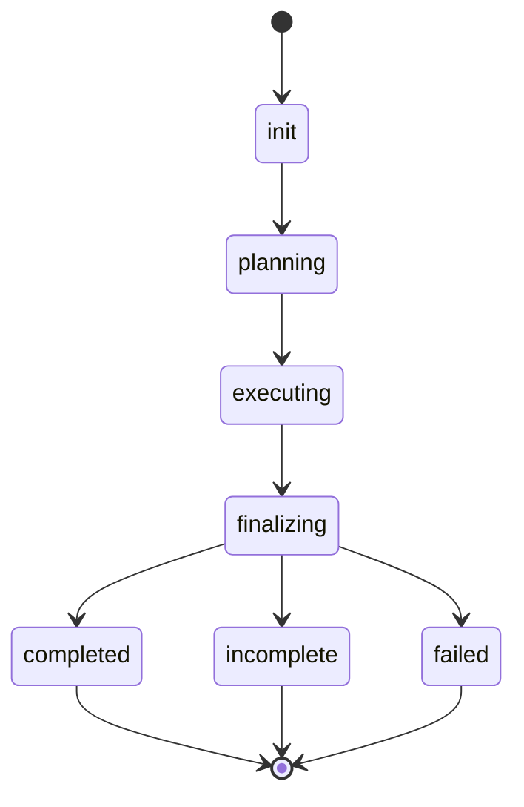

# Developer Tooling (Makefile + README) Implementation Plan

> **For agentic workers:** REQUIRED SUB-SKILL: Use superpowers:subagent-driven-development (recommended) or superpowers:executing-plans to implement this plan task-by-task. Steps use checkbox (`- [ ]`) syntax for tracking.

**Goal:** Add a `Makefile` of static-check / dependency targets and rewrite `README.md` into an accurate, comprehensive operator/contributor guide for the current single-plan, direct-edit harness — implementing `docs/specs/0002-developer-tooling.md` exactly.

**Architecture:** Two artifacts only. The `Makefile` wraps the existing `uv`/`ruff`/`pyright`/`pytest` toolchain into nine phony targets whose `lint`/`test`/`ci` commands are byte-for-byte identical to `scripts/ci.sh` (which is **not** modified). The `README.md` is rewritten from scratch so that every factual claim traces to a verified codebase fact in spec §3 — and nothing absent from the source (e.g. `verify_command`, `resume`, `ANTHROPIC_API_KEY`, the wave loop) appears.

**Tech Stack:** GNU make · `uv` (sync/lock/build) · `ruff` · `pyright` · `pytest` · `scripts/check_docstrings.py` · GitHub-flavored Markdown + a Mermaid state diagram.

**Source of truth:** `docs/specs/0002-developer-tooling.md`, cited inline as `§N`. Every codebase fact the README asserts is pinned there with a `path:line` citation (spec §3).

---

## Global Constraints

Every task's requirements implicitly include this section. Values are copied verbatim from the spec.

- **Exactly two artifacts, nothing else.** This change set produces `Makefile` and `README.md` only (spec §1). **`scripts/ci.sh` is NOT modified** (spec §1, §4.4). **No new test files** are created — adding one would be a third artifact and is out of scope.
- **No deferred / out-of-scope work.** Everything in the spec is implemented in this change set; there is no future work (spec §1: *"There is no deferred or out-of-scope work."*).
- **Makefile targets — exactly nine, in this order:** `help`, `setup-tools`, `setup`, `update`, `fmt`, `lint`, `test`, `build`, `ci` (spec §4.1 `.PHONY` line).
- **`ci.sh` parity (spec §4.4, the highest-stakes invariant):**
  - `make lint` = `ci.sh:3-6` → `uv run ruff check src tests scripts` · `uv run ruff format --check src tests scripts` · `uv run pyright` · `uv run python scripts/check_docstrings.py src tests scripts`
  - `make test` = `ci.sh:7` → `uv run pytest`
  - `make ci` = `lint` then `test` = the **same five commands in the same order** as `ci.sh`.
- **Check roots are always `src tests scripts`** (verbatim, in that order) for every ruff/pyright/docstring command (spec §3.8, §4.2).
- **Every Makefile target carries a three-section `Design: / Implementation: / Example:` comment block** plus a trailing `## …` help line (spec §2, §4.3). This mirrors the Rule-21 docstring discipline `scripts/check_docstrings.py` enforces on Python; the checker does not parse Makefiles, so this is a documentation convention.
- **`setup-tools` bootstraps `uv` only.** `codex` and `claude` are documented manual prerequisites; the Makefile never touches global npm (spec §2).
- **Shared uv cache.** No `UV_CACHE_DIR` override — keep uv's default shared cache (spec §6). `setup` uses `--locked`; `update`'s post-upgrade `sync` does not (spec §4.2, §6).
- **README content rule:** the README may state **only** facts that appear in spec §3. Anything absent from the source is absent from the README: no `doctor`/`version` subcommand, no `verify_command`/`verify_timeout_seconds`/`resume`/`ignore_prior_attempts` parameter, no `ANTHROPIC_API_KEY`/`CLAUDE_CODE_OAUTH_TOKEN` handling, no `CONCURRENCY_CAP`, no wave loop, no copy-sandbox/merge language, no `run_id`/`runtime_seconds`/`artifacts`/`failed_phase`/`error_class`/`iterations_used` RunResult fields, no `plans/<id>/`/`planset.json`/`manifest.json`/`merge.json` artifacts (spec §3.1–§3.7, §5).
- **Package facts (verbatim):** `requires-python = ">=3.11"`; license MIT; `__version__ = "0.1.0"`; dev tools are an **extra** (`[project.optional-dependencies].dev`), **not** a PEP-735 group — so `uv sync --all-extras` is correct and `--dev` is wrong (spec §3.8, §6).
- **Makefile recipe lines are TAB-indented.** GNU make requires a literal TAB (not spaces) before each recipe command. Comment-block lines (`# …`) and the `target: ## …` line begin at column 0.

---

## Recommended Option Decisions

The spec pre-decides almost everything (spec §6). The decisions below are binding for the tasks.

**D1 — Verification is shell commands, not new test files.** ✅ chosen.
- *Why:* the spec scopes this change to two artifacts and explicitly accepts the `Makefile`↔`ci.sh` hand-sync tradeoff (spec §4.4); the user instruction is "no out of scope work." A committed `tests/test_makefile.py` drift-guard would be a third artifact. Instead, each task's verify step is a runnable shell check — most importantly the parity diff `diff <(make -n ci) <(sed -n '3,7p' scripts/ci.sh)`, which **is** the byte-for-byte ci.sh check, performed at implementation time. This is the best-practice choice *within the spec's scope*, not the lazy one.
- *Consequence:* no files are added beyond `Makefile` and `README.md`. `tests/test_scaffold.py::test_ci_script_executable` keeps passing because `scripts/ci.sh` is never touched.

**D2 — Spec §6 toolchain choices carried forward verbatim (spec-decided; recorded for completeness).** ✅
- `setup` = `uv sync --locked --all-extras` (reproducible onboarding; `--locked` fails fast on a stale lock; `--all-extras` pulls the `dev` extra; **not** `--dev`, which selects a PEP-735 group this project does not define).
- `update` = `uv lock --upgrade` then `uv sync --all-extras` (re-resolve to newest allowed, then install the freshly written lock — so no `--locked` on this `sync`).
- No `UV_CACHE_DIR` override (keep uv's shared cache).
- `fmt`/`lint` kept separate so a verification run never silently rewrites the tree.

**D3 — `make ci` mirrors `ci.sh` by duplication, not delegation (spec-decided).** ✅
- *Why:* rewriting `ci.sh` to `exec make ci` was considered and declined to keep the change scoped to the two new artifacts (spec §2, §4.4). The two definitions are kept identical by the byte-for-byte discipline of §3.8 and guarded at implementation time by D1's parity diff.

---

## File Structure

- **Create:** `Makefile` — nine phony targets (`help`, `setup-tools`, `setup`, `update`, `fmt`, `lint`, `test`, `build`, `ci`), each with a `Design/Implementation/Example` comment block and a `## ` help line. Built up across Tasks 1–3 in `.PHONY` order so each task **appends** to the end of the file.
- **Overwrite:** `README.md` — currently a one-line stub (`# FORGE MCP`); rewritten from scratch in Task 4 to the twelve sections of spec §5.
- **Untouched (do not edit):** `scripts/ci.sh`, `pyproject.toml`, anything under `src/` or `tests/`.

---

## Task ordering

Tasks 1–3 build the single `Makefile` in `.PHONY` order — `help` first, then the dependency-management group, then the gate + build group — so every task simply appends its targets to the end of the growing file. Task 4 is the independent README rewrite. Commit after every task.

---

### Task 1: Makefile foundation + `help`

**Files:**
- Create: `Makefile`

**Interfaces:**
- Consumes: nothing.
- Produces: a `Makefile` with the spec §4.1 conventions header (`SHELL`, `.SHELLFLAGS`, `.DEFAULT_GOAL := help`, and the full `.PHONY: help setup-tools setup update fmt lint test build ci`) and a self-documenting `help` target. `make` with no args runs `help`; `help` prints, for every line matching `^[a-zA-Z][a-zA-Z0-9_-]*:.*## `, the target name and its trailing `## ` description. Later tasks rely on `help` auto-listing any target they append.

- [ ] **Step 1: Confirm the verification fails (no Makefile yet)**

Run: `make help`
Expected: FAIL — `make: *** No targets specified and no makefile found.  Stop.` (no `Makefile` exists).

- [ ] **Step 2: Write `Makefile` (recipe line is TAB-indented)**

Create `Makefile` with exactly this content:

```make
SHELL := bash
.SHELLFLAGS := -eu -o pipefail -c
.DEFAULT_GOAL := help
.PHONY: help setup-tools setup update fmt lint test build ci

# help — print every target and its one-line description (the default goal).
#
# Design: a self-documenting Makefile so plain `make` lists what is runnable,
#   keeping discovery in the Makefile itself rather than a separate doc (§4.2).
# Implementation: awk scans MAKEFILE_LIST for lines matching a target followed by
#   a `## ` comment (regex `^[a-zA-Z][a-zA-Z0-9_-]*:.*## ` — the `_-` in the class
#   is required so `setup-tools:` matches) and prints "name  description". The
#   comment-block `#` lines start with `# ` so they never match.
# Example: `make` or `make help` prints the aligned target table.
help: ## Show this help (targets + one-line descriptions)
	@awk 'BEGIN {FS = ":.*## "} /^[a-zA-Z][a-zA-Z0-9_-]*:.*## / {printf "  \033[36m%-13s\033[0m %s\n", $$1, $$2}' $(MAKEFILE_LIST)
```

> TAB note: the `@awk …` line MUST begin with a single literal TAB. The `$$1`/`$$2` are doubled to escape make's `$`; `$(MAKEFILE_LIST)` is a make variable.

- [ ] **Step 3: Run the verification — it passes**

Run: `make help`
Expected: PASS — prints exactly one row:
```
  help          Show this help (targets + one-line descriptions)
```
Run: `make`
Expected: identical output (`.DEFAULT_GOAL := help`).

- [ ] **Step 4: Commit**

```bash
git add Makefile
git commit -m "feat(make): add Makefile foundation with self-documenting help"
```

---

### Task 2: Dependency-management targets — `setup-tools`, `setup`, `update`

**Files:**
- Modify: `Makefile` (append after the `help` block)

**Interfaces:**
- Consumes: the Task 1 conventions header (`SHELL`, `.SHELLFLAGS`, `.PHONY`) and the `help` target (auto-lists these new targets).
- Produces: `setup-tools` (idempotent `uv` bootstrap), `setup` (`uv sync --locked --all-extras`), `update` (`uv lock --upgrade` then `uv sync --all-extras`). `make help` now lists four targets.

- [ ] **Step 1: Confirm the verification fails (targets absent)**

Run: `make -n setup`
Expected: FAIL — `make: *** No rule to make target 'setup'.  Stop.`

- [ ] **Step 2: Append the three targets to `Makefile` (recipe lines TAB-indented)**

Append exactly this to the end of `Makefile`:

```make

# setup-tools — bootstrap the only host tool the Makefile manages: uv.
#
# Design: §2 scopes host bootstrap to uv alone; the codex binary and claude CLI
#   are documented manual prerequisites, so this never touches global npm.
# Implementation: idempotent — `command -v uv` short-circuits when uv is already
#   on PATH; otherwise install via the official astral.sh script. The `|| …`
#   form is safe under `set -e` because the guard is the left side of `||`.
# Example: `make setup-tools` is a no-op on a machine that already has uv.
setup-tools: ## Install uv if missing (no-op when present)
	command -v uv >/dev/null 2>&1 || curl -LsSf https://astral.sh/uv/install.sh | sh

# setup — install the project + dev tools from the pinned lockfile.
#
# Design: reproducible onboarding — §6 mandates `--locked` so a stale lock fails
#   fast instead of silently re-resolving; changing dependencies is `update`'s job.
# Implementation: `uv sync --locked --all-extras` installs exactly uv.lock and
#   pulls the `dev` extra (§3.8 — dev tools live in optional-dependencies, an
#   extra, so `--all-extras` is correct and `--dev`, a PEP-735 group flag, is not).
# Example: `make setup` after `make setup-tools` yields a ready dev environment.
setup: ## Install deps from the locked file (dev extra included)
	uv sync --locked --all-extras

# update — re-resolve every dependency to the newest allowed, then install.
#
# Design: §6 — `uv lock --upgrade` is the documented way to move every package to
#   the latest version permitted by pyproject constraints; host tools are
#   refreshed separately by re-running `setup-tools`.
# Implementation: `uv lock --upgrade` rewrites uv.lock, then `uv sync --all-extras`
#   installs it — no `--locked` here because the lock was just rewritten.
# Example: `make update`, then commit the changed uv.lock.
update: ## Re-lock to latest allowed versions, then install
	uv lock --upgrade
	uv sync --all-extras
```

- [ ] **Step 3: Run the verifications — they pass**

Run: `make -n setup`
Expected: PASS — prints exactly:
```
uv sync --locked --all-extras
```
Run: `make -n update`
Expected: prints exactly:
```
uv lock --upgrade
uv sync --all-extras
```
Run: `make -n setup-tools`
Expected: prints the `command -v uv … || curl … | sh` line.
Run: `make help`
Expected: now lists four targets (`help`, `setup-tools`, `setup`, `update`) with their descriptions.

- [ ] **Step 4: Confirm `setup-tools` idempotency (no-op when uv present)**

Run: `command -v uv && make setup-tools && echo "NO-OP OK"`
Expected: `uv` is found, `make setup-tools` runs the guard, the `curl` install does **not** run, and `NO-OP OK` prints. (The Makefile is under test in this repo, where `uv` is already installed.)

- [ ] **Step 5: Commit**

```bash
git add Makefile
git commit -m "feat(make): add uv setup-tools/setup/update targets"
```

---

### Task 3: Gate + build targets — `fmt`, `lint`, `test`, `build`, `ci`

**Files:**
- Modify: `Makefile` (append after the `update` block)

**Interfaces:**
- Consumes: the Task 1 conventions header and `help`; the Task 2 targets (file order continues).
- Produces: `fmt` (mutating ruff autofix+format), `lint` (the four read-only checks = `ci.sh:3-6`), `test` (`uv run pytest` = `ci.sh:7`), `build` (`uv build`), `ci` (prerequisite-only `ci: lint test`). After this task, `make help` lists all **nine** targets, and `make -n ci` emits the same five commands, in the same order, as `scripts/ci.sh`.

- [ ] **Step 1: Confirm the parity verification fails (gate targets absent)**

Run: `make -n ci`
Expected: FAIL — `make: *** No rule to make target 'ci'.  Stop.`

- [ ] **Step 2: Append the five targets to `Makefile` (recipe lines TAB-indented)**

Append exactly this to the end of `Makefile`:

```make

# fmt — apply ruff autofixes and format sources in place.
#
# Design: separate the mutating "fix it" action from the read-only `lint` gate so
#   verification never silently rewrites files; mirrors §3.8's fmt/lint split.
# Implementation: `ruff check --fix` first (lint/import autofixes), then
#   `ruff format`, both over `src tests scripts` — the same roots ci.sh and lint use.
# Example: `make fmt` rewrites imports and reformats; inspect with `git diff`.
fmt: ## Apply ruff autofixes + format (mutates files)
	uv run ruff check --fix src tests scripts
	uv run ruff format src tests scripts

# lint — run the four read-only static checks (ci.sh:3-6) without mutating files.
#
# Design: §4.4 keeps these byte-for-byte identical to ci.sh's first four steps so
#   `make ci` and scripts/ci.sh can never drift; lint is non-mutating so a check
#   run never rewrites the tree it inspects.
# Implementation: ruff check, ruff format --check, pyright, then the Rule-21
#   docstring checker — each over `src tests scripts`, exactly as ci.sh:3-6.
# Example: `make lint` exits non-zero on the first failing check.
lint: ## Run ruff + pyright + docstring checks (read-only)
	uv run ruff check src tests scripts
	uv run ruff format --check src tests scripts
	uv run pyright
	uv run python scripts/check_docstrings.py src tests scripts

# test — run the pytest suite (slow tests excluded by default).
#
# Design: §4.4 — identical to ci.sh:7; slow/real-CLI tests are excluded by the
#   pyproject `addopts = "-m 'not slow'"` default (§3.8), so the gate stays fast.
# Implementation: `uv run pytest` honors pyproject's testpaths and addopts; run
#   slow tests on demand with `uv run pytest -m slow`.
# Example: `make test` runs the default (fast) suite; FAILs surface as non-zero.
test: ## Run the pytest suite (fast; slow excluded)
	uv run pytest

# build — produce the wheel and sdist with the hatchling backend.
#
# Design: §3.8 — the package builds with hatchling; `uv build` is the standard
#   front-end producing both a wheel and an sdist under dist/.
# Implementation: `uv build` reads pyproject's build-system and writes the
#   forge_mcp-<version> wheel and the .tar.gz sdist to dist/.
# Example: `make build` then `ls dist/` shows the .whl and .tar.gz.
build: ## Build wheel + sdist into dist/
	uv build

# ci — the aggregate gate: lint then test (the same five commands as ci.sh).
#
# Design: §4.4 — `ci` is the local mirror of scripts/ci.sh; expanding to `lint`
#   then `test` runs the identical five commands in the identical order, so the
#   two entry points cannot behave differently.
# Implementation: a prerequisite-only target (`ci: lint test`) — make runs lint's
#   four checks, then test's pytest; it has no recipe body of its own.
# Example: `make ci` is the one command to run before pushing.
ci: lint test ## Run the full local gate (= scripts/ci.sh)
```

- [ ] **Step 3: Run the ci.sh parity verifications — they pass**

Run: `diff <(make -n lint) <(sed -n '3,6p' scripts/ci.sh) && echo "LINT PARITY OK"`
Expected: no diff output, then `LINT PARITY OK`.

Run: `diff <(make -n test) <(sed -n '7p' scripts/ci.sh) && echo "TEST PARITY OK"`
Expected: no diff output, then `TEST PARITY OK`.

Run: `diff <(make -n ci) <(sed -n '3,7p' scripts/ci.sh) && echo "CI PARITY OK"`
Expected: no diff output, then `CI PARITY OK` — `make -n ci` emits exactly:
```
uv run ruff check src tests scripts
uv run ruff format --check src tests scripts
uv run pyright
uv run python scripts/check_docstrings.py src tests scripts
uv run pytest
```

Run: `make help`
Expected: lists all nine targets:
```
  help          Show this help (targets + one-line descriptions)
  setup-tools   Install uv if missing (no-op when present)
  setup         Install deps from the locked file (dev extra included)
  update        Re-lock to latest allowed versions, then install
  fmt           Apply ruff autofixes + format (mutates files)
  lint          Run ruff + pyright + docstring checks (read-only)
  test          Run the pytest suite (fast; slow excluded)
  build         Build wheel + sdist into dist/
  ci            Run the full local gate (= scripts/ci.sh)
```

- [ ] **Step 4: Confirm `build` produces a wheel + sdist, and the gate is green**

Run: `make build && ls dist/*.whl dist/*.tar.gz && echo "BUILD OK"`
Expected: `uv build` runs; `dist/` contains a `forge_mcp-0.1.0-…​.whl` and a `forge_mcp-0.1.0.tar.gz`; prints `BUILD OK`. (`dist/` is a build artifact — do not stage it; confirm `git status` does not show it, i.e. it is gitignored, and otherwise `rm -rf dist`.)

Run: `make ci`
Expected: PASS — the full gate (ruff check · ruff format --check · pyright · check_docstrings · pytest) is green. Because no Python or `scripts/ci.sh` was touched, this confirms the Makefile did not regress anything; `tests/test_scaffold.py::test_ci_script_executable` is included and stays green.

- [ ] **Step 5: Commit**

```bash
git add Makefile
git commit -m "feat(make): add fmt/lint/test/build/ci gate targets (ci.sh parity)"
```

---

### Task 4: Rewrite `README.md` to the single-plan harness

**Files:**
- Overwrite: `README.md` (currently the one-line stub `# FORGE MCP`)

**Interfaces:**
- Consumes: nothing in this repo at build time — but **every** factual claim is consumed from spec §3 and must match it verbatim (state strings, field names, help text, error messages, env-var names, probe labels).
- Produces: the twelve-section README of spec §5. No `develop`-era or non-existent surface appears (Global Constraints, README content rule).

- [ ] **Step 1: Define the conformance verification and confirm it fails on the stub**

The README's correctness contract is checkable by grep. Run this against the current stub:

```bash
# (a) Forbidden develop-era / non-existent surface must NOT appear:
grep -nE 'doctor|verify_command|\bresume\b|ignore_prior_attempts|CONCURRENCY_CAP|runtime_seconds|\brun_id\b|planset|manifest\.json|merge\.json|conflict_fingerprint|copy-sandbox|\bsandbox\b|\bwave\b' README.md \
  && echo "FORBIDDEN SURFACE PRESENT (fail)" || echo "no forbidden surface"
# (b) Required content must appear:
for s in 'run_forge' 'FORGE_CLAUDE_BIN' 'FORGE_CODEX_BIN' 'CLAUDE_CONFIG_DIR' 'CODEX_HOME' 'incomplete' '0.1.0' 'MIT'; do
  grep -q "$s" README.md || echo "MISSING: $s"
done
```

Expected on the stub: (a) prints `no forbidden surface`; (b) prints a `MISSING:` line for nearly every required string (the stub has only `# FORGE MCP`). The missing-content failures are what Step 2 fixes.

- [ ] **Step 2: Overwrite `README.md` with the full content**

Write `README.md` with exactly this content:

````markdown
# forge-mcp

`forge-mcp` is a stdio [MCP](https://modelcontextprotocol.io) server that exposes a single tool, **`run_forge`**, which implements a feature from a design document directly into a target directory. It drives a **Planner** (Claude) that produces **one** plan, then a **Generator** (Codex) → **Evaluator** (Claude) iteration loop that edits `target_dir` in place until the plan is done or the run stops honestly. Every artifact of a run is persisted under `<target_dir>/.harness/<run-id>/`. This is version `0.1.0`.

## How it works

A single run does three things, in order:

1. **Plan once.** The Planner (Claude) reads the design document and produces exactly **one** plan.
2. **Iterate one loop.** A single iteration loop runs directly on `target_dir`: **generate** (Codex edits the directory) → optional **verify** → **evaluate** (Claude) → optional **triage** → **converge**. Design-fault amendments are applied **in-loop**. The loop stops when the plan reaches `done`, or — when it stops making progress — honestly reports `incomplete` rather than spinning.
3. **Finalize.** The run returns a `RunResult` describing the outcome.

Each phase runs in a **fresh SDK session** — no conversation or model state is carried across phases. Phases hand off **only** through the on-disk artifacts under `.harness/<run-id>/`. The Generator edits the repository in place and leaves its changes **uncommitted**, for you to review with your own git.

## Prerequisites

- **Python ≥ 3.11**
- **[uv](https://docs.astral.sh/uv/)** — installed by `make setup-tools`
- **git** — on your `PATH`
- **The `codex` binary** — `npm install -g @openai/codex` (a manual prerequisite)
- **The `claude` CLI** — installed separately (a manual prerequisite)

`codex` and `claude` are **not** installed by the Makefile; install them yourself.

## Setup

```bash
make setup-tools     # install uv (no-op if already present)
make setup           # install the project + dev tools from the lockfile
uv run forge check   # verify your environment
```

`forge check` runs ten preflight probes, in order:

1. `target writable` — the target directory exists, is a directory, and is writable
2. `git available` — `git` is on `PATH`
3. `claude CLI` — the `claude` binary is present
4. `codex binary` — the `codex` binary is present
5. `openai_codex importable` — the `openai_codex` package imports
6. `codex --version smoke` — `codex --version` runs
7. `SDK contract` — the Claude SDK seam symbols import
8. `disk space` — enough free space (warns below 500 MiB)
9. `codex-skill:<id>` — required Codex filesystem skills are installed
10. `claude-skill:<id>` — required Claude session skills are discoverable

Each row prints as `[STATUS] label: detail`, where `STATUS` is `OK`, `WARN`, or `FAIL`. Exit code `0` means no failures. **A `WARN` never fails the check** — only a `FAIL` does, and any `FAIL` must be fixed before serving.

## Register with Claude Code

```bash
claude mcp add forge-mcp -- uv run --directory "$PWD" forge serve
```

To override the codex binary path or the Claude config root, pass `-e` flags **before** the `--`:

```bash
claude mcp add forge-mcp \
  -e FORGE_CODEX_BIN=/path/to/codex \
  -e CLAUDE_CONFIG_DIR=/path/to/.claude \
  -- uv run --directory "$PWD" forge serve
```

`forge serve` runs the same preflight as `forge check` and **refuses to start** if any probe reports `FAIL`.

## The `run_forge` tool

`run_forge` takes five parameters:

| # | Parameter | Type | Default | Description |
|---|-----------|------|---------|-------------|
| 1 | `target_dir` | `str` | *(required)* | Directory the Generator reads and writes |
| 2 | `design_doc_path` | `str \| None` | `None` | Path to the design doc — provide this **or** `design_doc_content` |
| 3 | `design_doc_content` | `str \| None` | `None` | Inline design text — provide this **or** `design_doc_path` |
| 4 | `max_iterations` | `int` | `10` | Maximum generate→evaluate→triage loops for the plan |
| 5 | `max_runtime_minutes` | `int` | `600` | Hard wall-clock cap for the whole run |

**Exactly one** of `design_doc_path` / `design_doc_content` is required:

- both set → `Provide exactly one of design_doc_path or design_doc_content, not both.`
- neither set → `Exactly one of design_doc_path or design_doc_content is required.`

The tool returns a `RunResult`:

| Field | Type | Default | Meaning |
|-------|------|---------|---------|
| `status` | `"completed" \| "incomplete" \| "failed"` | *(required)* | Run outcome (see below) |
| `run_dir` | `str` | *(required)* | The `.harness/<run-id>/` directory for this run |
| `iterations` | `int` | *(required)* | Number of iterations the loop ran |
| `unresolved_gaps` | `list[GapSummary]` | `[]` | Gaps left open when the run did not complete |
| `failure_kind` | `str \| None` | `None` | Exception type name — set only when `status == "failed"` |
| `stop_reason` | `str \| None` | `None` | Why the run stopped (populated for `incomplete`) |
| `verified` | `bool` | *(required)* | Whether a declared verification command passed |
| `summary` | `str` | *(required)* | Human-readable summary |

`status` values:

- **`completed`** — the plan reached `done`.
- **`incomplete`** — the plan did not complete; `unresolved_gaps` is populated and `stop_reason` explains why.
- **`failed`** — an internal error stopped the run; `failure_kind` holds the exception type name.

`verified` is `True` **only when** the plan is `done` **and** the plan declared a verification command — an honest `False` otherwise.

Each `GapSummary` has `title`, `severity`, and `design_doc_section` (all `str`).

If a run exceeds `max_runtime_minutes`, it is **not** an error: the tool returns an `incomplete` `RunResult` rather than raising.

## Run lifecycle

A run moves through **seven** states:

`init` · `planning` · `executing` · `finalizing` · `completed` · `incomplete` · `failed`

The last three (`completed`, `incomplete`, `failed`) are **terminal**. The legal transitions are:



`failed` is additionally reachable from **any** non-terminal state — an internal error can stop the run at any point.

While iterating, the loop tracks progress by fingerprint and applies a non-progress policy: a **`NUDGE`** nudges the next iteration when recent iterations repeat, and an **`EARLY_STOP`** ends the run as `incomplete` when progress has clearly stalled. Hitting `max_iterations` also ends the run as `incomplete`.

## Artifacts

Every run writes to a flat directory tree under the target:

```
<target_dir>/.harness/
├── .gitignore            # contains "*" — the whole .harness tree is self-ignored
└── <run-id>/             # run-id is a 14-digit timestamp (optional -NN suffix)
    ├── state.json        # run-level checkpoint
    ├── run.log
    ├── spec.md
    ├── spec_amendments.md
    ├── spec.fingerprint
    ├── plan.json         # the single structured plan
    ├── plan.md           # the plan body
    ├── plan_state.json   # the single plan's state
    ├── inputs/
    │   ├── design.md            # the frozen design document
    │   └── design.fingerprint
    └── iteration-<n>/
        ├── contract.md
        ├── summary.md
        ├── eval.json
        ├── triage.json
        ├── gap_fingerprint.json
        └── verify.txt
```

The run directory is created at mode `0700`. Because `.harness/.gitignore` contains `*`, all run artifacts are ignored by your repository's git automatically.

## CLI reference

The `forge` console script — equivalently `python -m forge_mcp` — has two subcommands.

### `forge serve`

Runs preflight, then starts the stdio MCP server. Takes no options. Refuses to start if any preflight probe reports `FAIL`.

### `forge check`

Runs the ten preflight probes and prints each as `[STATUS] label: detail`. Exits `1` if any probe is a `FAIL`.

| Option | Default | Description |
|--------|---------|-------------|
| `--target-dir TEXT` | `None` | Target directory to probe. |
| `--live-claude` / `--no-live-claude` | `--live-claude` | Probe the live Claude session for skill discovery (default on; `--no-live-claude` skips it for a fast offline check). |

## Configuration

forge-mcp reads exactly **four** environment variables:

| Variable | Default | Purpose |
|----------|---------|---------|
| `FORGE_CLAUDE_BIN` | `which("claude")` → `~/.local/bin/claude` | Override the `claude` binary path |
| `FORGE_CODEX_BIN` | `which("codex")` → `~/.npm-global/bin/codex` | Override the `codex` binary path |
| `CLAUDE_CONFIG_DIR` | `~/.claude` | Select the Claude config/profile root |
| `CODEX_HOME` | `~/.codex` | Codex home used to locate skills during `forge check` |

forge-mcp reads **only** these. It does **not** read `ANTHROPIC_API_KEY` or any other credential — Claude and Codex authentication is configured through those tools' own login mechanisms.

## Development

Run `make help` to list every target:

| Target | What it does |
|--------|--------------|
| `make setup-tools` | Install uv if missing (no-op when present) |
| `make setup` | Install deps from the locked file (dev extra included) |
| `make update` | Re-lock to latest allowed versions, then install |
| `make fmt` | Apply ruff autofixes + format (mutates files) |
| `make lint` | Run ruff + pyright + docstring checks (read-only) |
| `make test` | Run the pytest suite (fast; slow excluded) |
| `make build` | Build wheel + sdist into `dist/` |
| `make ci` | Run the full local gate (= `scripts/ci.sh`) |

- **`make lint`** runs four read-only checks: `ruff check`, `ruff format --check`, `pyright`, and the Rule-21 docstring checker (`scripts/check_docstrings.py`, which requires a `Design:` / `Implementation:` / `Example:` section — each ≥ 5 non-whitespace characters — in every non-trivial docstring).
- **`make test`** runs the fast suite. Slow / real-CLI tests are excluded by default; run them with `uv run pytest -m slow`.
- **`make ci`** runs `lint` then `test` — the **same five commands, in the same order**, as `scripts/ci.sh`.
- **`make fmt`** is the mutating counterpart of `lint`; it rewrites files in place.
- **`make build`** produces a wheel and an sdist under `dist/`.

## License

MIT
````

- [ ] **Step 3: Run the conformance verification — it passes**

```bash
# (a) Forbidden surface — must print "no forbidden surface":
grep -nE 'doctor|verify_command|\bresume\b|ignore_prior_attempts|CONCURRENCY_CAP|runtime_seconds|\brun_id\b|planset|manifest\.json|merge\.json|conflict_fingerprint|copy-sandbox|\bsandbox\b|\bwave\b' README.md \
  && echo "FORBIDDEN SURFACE PRESENT (fail)" || echo "no forbidden surface"
# (b) Required content — must print nothing (no MISSING lines):
for s in 'run_forge' 'FORGE_CLAUDE_BIN' 'FORGE_CODEX_BIN' 'CLAUDE_CONFIG_DIR' 'CODEX_HOME' 'incomplete' '0.1.0' 'MIT'; do
  grep -q "$s" README.md || echo "MISSING: $s"
done
# (c) The ANTHROPIC note must be the only mention, in the negative:
grep -n 'ANTHROPIC_API_KEY' README.md
```

Expected: (a) prints `no forbidden surface`; (b) prints nothing; (c) prints exactly one line — the "does **not** read `ANTHROPIC_API_KEY`" sentence in **Configuration**.

- [ ] **Step 4: Diff the README against spec §3 (manual accuracy pass)**

Read `README.md` top to bottom alongside spec §3 and confirm each load-bearing string matches verbatim: the two `run_forge` error messages (§3.2); the five-parameter table and its defaults (§3.2); the eight `RunResult` fields and the `verified` semantics (§3.3); the seven state names and the Mermaid edges (§3.4); the four env vars and their defaults (§3.6); the ten probe labels in order and the 500 MiB / `WARN`-never-fails wording (§3.7); `0.1.0`, Python ≥ 3.11, MIT (§3.8). Fix any mismatch, then re-run Step 3.

- [ ] **Step 5: Commit**

```bash
git add README.md
git commit -m "docs(readme): rewrite README for the single-plan direct-edit harness"
```

---

## Self-Review

**1. Spec coverage** — every spec section maps to a task:

| Spec section | Requirement | Task |
|---|---|---|
| §1, §4.1–§4.2 | Nine targets; `ci.sh` untouched; two artifacts only | Tasks 1–3 (D1) |
| §2, §4.3 | `Design/Implementation/Example` block + `## ` help per target | Tasks 1–3 (each target) |
| §4.2, §6 | `setup-tools` (uv-only, idempotent), `setup` (`--locked --all-extras`), `update` (`lock --upgrade` + `sync`) | Task 2 |
| §4.2, §4.4 | `fmt`/`lint`/`test`/`ci` with byte-for-byte `ci.sh` parity; `build` | Task 3 (parity diffs in Step 3) |
| §3.7, §7.2 | `ci.sh` stays present + executable → `test_ci_script_executable` green | Task 3 Step 4 (no `ci.sh`/Python edits) |
| §5.1–§5.12 | Twelve README sections, accurate to §3 | Task 4 |
| §3.1–§3.7 | No `develop`-era / non-existent surface in README | Task 4 Steps 1, 3 (grep gate) |
| §7 (done criteria) | `make help`, lint/test/ci parity, idempotent setup-tools, build → dist/, comment blocks, README↔§3 | Tasks 1–4 verify steps |

No spec requirement is unmapped; no task exists that the spec does not require.

**2. Placeholder scan** — no `TBD`/`TODO`/"add error handling"/"similar to Task N". Every Makefile target and the entire README are shown verbatim.

**3. Consistency** — target names, help strings, and the nine-target `.PHONY` line are identical across Tasks 1–3 and the README **Development** table. The README's quoted strings are the spec §3 verbatim values. Recipe-line TAB indentation is called out in Global Constraints and in each Makefile task.

---

## Execution Handoff

Plan complete and saved to `docs/plans/0003-developer-tooling.md`. Two execution options:

**1. Subagent-Driven (recommended)** — I dispatch a fresh subagent per task, review between tasks, fast iteration.

**2. Inline Execution** — execute tasks in this session using executing-plans, batch execution with checkpoints.

Which approach?
